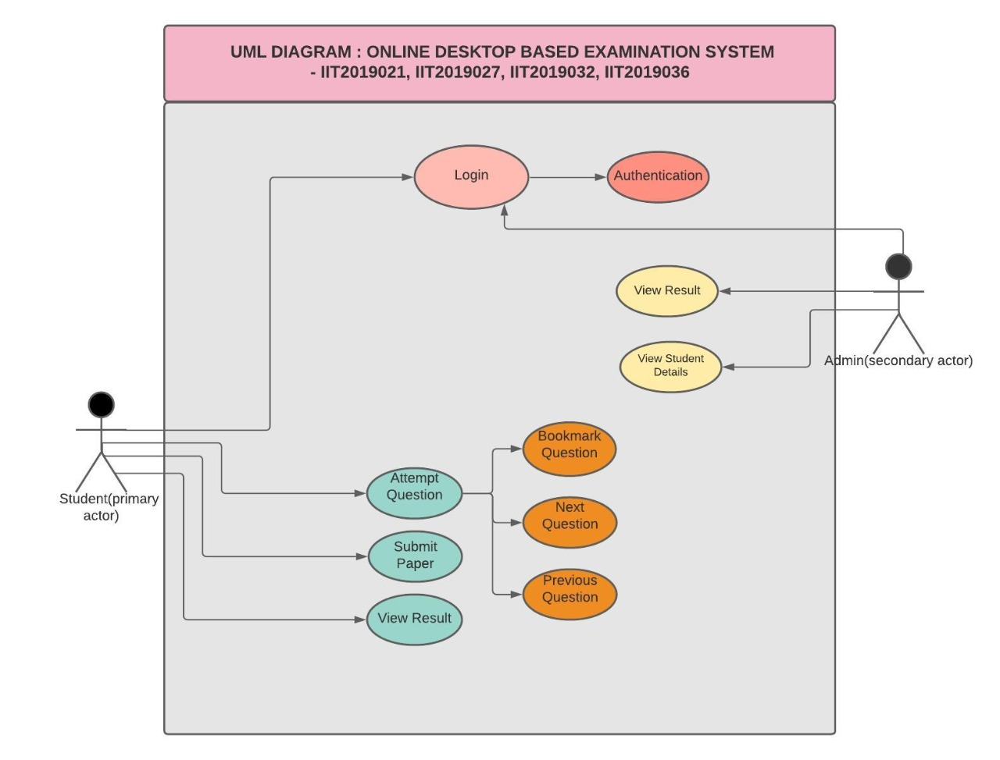
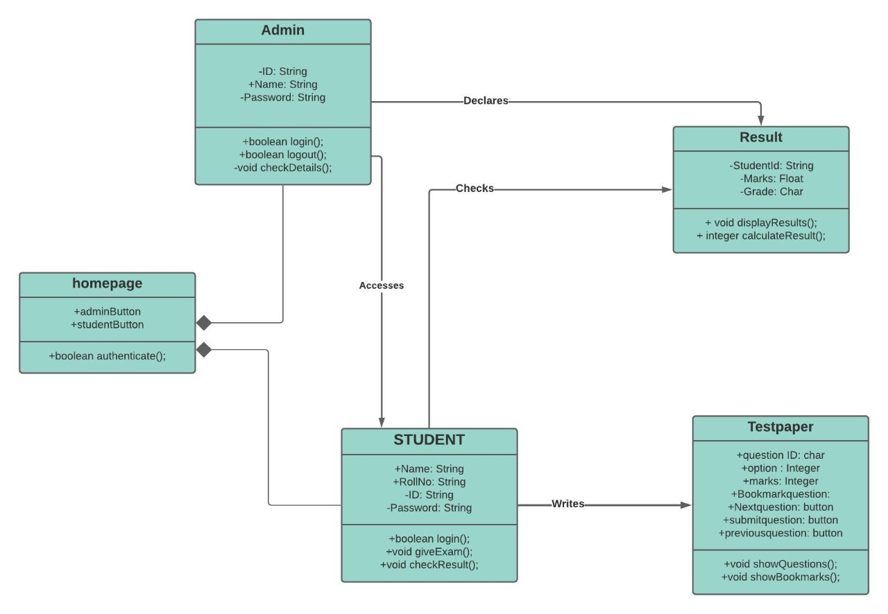

# :school: Online-Desktop-Based-Examination-System :school:
--------------------------------------------------------------------------------------------------------------------------------------------------------------------------------------------------------------------------------------------------------------------------------------------------------

## Abstract :memo:

In this project, we have designed and developed Software for Online Examination System in which there are given 10 questions to play :dart:. User can bookmark :bookmark::bookmark:any question for the reconsideration while going to result and can go to the next question by clicking the next button :arrow_forward:.Online Exams System fulfills the requirements of the institutes to conduct the exams online. We are using here java array to store the questions, options and answers and not using database technology.:book:  With the use of swing frames as container and buttons and checkboxes as their component, we have made this Project more enhancing. Software provides the options to students to select the Questions with increasing complexity levels if they want to achieve higher points resulting into better Grades, thus the software makes it possible to provide three levels of Questions as per complexity levels of Good, Tough and Complex ones. The scores are accordingly provided to the students with rules :beginner::beginner:(For Example) the  Best grades can only be achieved either by scoring more than 80 % correct responses of Good Questions and 25 % and 10 % each correct responses from Tough and Complex Questions. :information_desk_person: But Students can also correctly answer larger Questions from Tough and Complex Questions thus reducing the requirements of correctly answering the Questions from Good Questions.:bell: Thus, we have formulated appropriate Rules for this provision with a timer for specific time only :clock9:.

## Specific Technology :computer:
Java, Swing, JSF and XML

## Diagrams
<table>
  <tr>
     <td align="center"> <b>UML DIAGRAM</b></a> </td>
     <td align="center"> <b>CLASS DIAGRAM</b></a> </td>
     <td align="center"> <b>CRC DIAGRAM</b></a> </td>

 
 </tr>
</table>

## Functional components of the project :computer:
The Software should serve the purpose of examining the students :book: and their Result computation.
The Admin can see the registered students :girl: :boy: and their marks after thay have attempted the test.
The Student can give the test and after submitting his answers, he can check his result :heart_eyes: at the same time.

**Entering Questions: Various Fields are:**
* :star: Questions
* :star: Options (4)
* :star: Correct Answer

**Student Taking Exam Screen:** 
Various Fields are:
* :boom: Display Of Question With Options
* :boom: Control Buttons To switch questions
* :boom: A button to bookmark the question

**Result Displaying Screen: :mortar_board:** 
Various Fields are:
* :star: Total Marks
* :star: Result(Correct/Incorrect)

# Group Members:
<table>
  <tr>
     <td align="center"><a href="https://github.com/medhabalani"> <b>Medha</b></a> </td>
     <td align="center"><a href="https://github.com/vidushi1012"> <b>Vidushi</b></a> </td>
    <td align="center"><a href="https://github.com/xxx32"> <b>Aarushi</b></a> </td>
     <td align="center"><a href="https://github.com/Jyotika999"> <b>Jyotika</b></a> </td>

 
 </tr>
</table>

